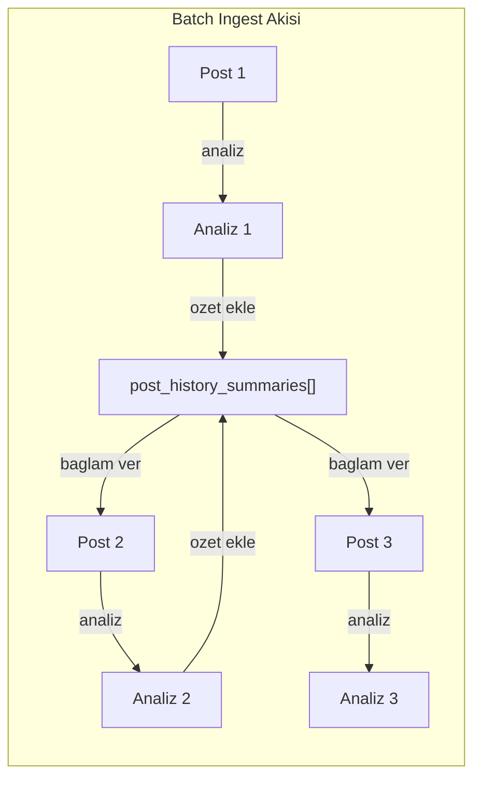

# RedKid Prompt ve Siniflandirma Sistemi Yeniden Tasarimi

## Mevcut Durum - Temel Sorunlar

Mevcut sistem genel amacli bir sosyal medya analiz araci gibi calistirilmak istenirken, hedef kullanim alani **teror ve organize suc istihbarati**. Asagidaki eksiklikler tespit edildi:

### 1. Post Analiz Promptu cok yuzeysel

Mevcut prompt (`app/main.py` satir 252-263 ve 458-467):

```252:263:app/main.py
    post_prompt = (
        "Aşağıdaki sosyal medya gönderisini tarafsız ve kısa analiz et.\n"
        f"Kullanıcı: {request.username}\n"
        f"Instagram: {request.instagram_username or '-'}\n"
        f"Profil foto URL: {request.profile_photo_url or '-'}\n"
        f"Biyografi: {request.bio or '-'}\n"
        f"Gönderi açıklaması: {request.caption or '-'}\n\n"
        "İstenen çıktı:\n"
        "1) Gönderinin kısa özeti\n"
        "2) İçerik tonu (bilgilendirici, duygusal, provokatif vb.)\n"
        "3) Varsa dikkat çeken riskli/şiddet unsuru (tarafsız ifade)\n"
    )
```

**Eksikler:** Gorsel/video icerik analizi yok (nerede cekildigi, ne gorunuyor), orgut baglantisi degerlendirmesi yok, tehdit/plan/itiraf tespiti yok, gelecek eylem imasi yok, kisinin orgutteki rolu hakkinda degerlendirme yok.

### 2. Yorum Siniflandirma Etiketleri yetersiz

Mevcut etiketler (`app/schemas.py` satir 27-28):

- `CommentVerdict`: `supportive | opposing | irrelevant | unclear`
- `CommentSentiment`: `positive | negative | neutral`

Bu etiketler sadece "gonderiyi destekliyor mu" sorusunu yanitliyor. Teror baglaminda yorumun **ne tur** bir destekten bahsettigini, tehdit icerip icermedigini, orgut baglantisini gosterip gostermedigini ayirt edemiyor.

### 3. Yorum Promptu post analiz ciktisini kullanmiyor (yeterince)

Mevcut yorum promptu post analizini metin olarak veriyor ama teror baglaminda ne anlama geldigini sormuyor.

### 4. Kumulatif Baglam Eksik (YENi)

Mevcut `ingest_instagram_account_latest` akisinda postlar sirayla isleniyor (`for post_json_key in post_json_keys`) ama her post birbirinden **tamamen bagimsiz** analiz ediliyor. Bu durumda:

- VLM, kullanicinin onceki postlarinda ne paylastigini bilmiyor
- Yorum analizi sirasinda, ayni kullanicinin baska postlara attigi yorumlar goz ardi ediliyor
- Bir kullanicinin **davranis oruntusunu** (pattern) tespit etmek mumkun degil

Ornegin: Bir kullanici ilk postunda daglarda bir foto paylasir, ikincisinde silahli bir grup gosterir, ucuncusunde cenaze torenine katilir -- bu ucunu birlikte goren bir analist "militan profili" cikarabilir. Mevcut sistemde her post birbirinden habersiz.

---

## Tasarim Kararlari

### Post Analiz Prompt - Yapilandirilmis JSON Cikti

Post analiz promptunu serbest metin yerine **yapilandirilmis JSON** formatinda cikti verecek sekilde degistiriyoruz. Bu sayede:

- Downstream yorum analizi daha iyi beslenecek
- DB'ye alanlar ayri ayri yazilabilecek
- Raporlama kolaylasacak

**Yeni post analiz JSON semasi:**

```json
{
  "ozet": "Gonderinin 2-3 cumlelik ozeti",
  "gorsel_analiz": {
    "sahne_tanimi": "Goruntuде/videoda ne var",
    "konum_tahmini": "Nerede cekildigi (ulke/sehir/arazi tipi)",
    "kisi_sayisi": 0,
    "silah_patlayici_var_mi": true,
    "bayrak_sembol_amblam": "Goruntudeki semboller, bayraklar, orgut amblemleri",
    "uniforma_kiyafet": "Askeri kiyafet, kamuflaj, ozel kiyafet"
  },
  "icerik_tonu": "bilgilendirici|propaganda|tahrik_edici|yas_anma|kutlama|tehdit|notral",
  "icerik_kategorisi": "asagidaki etiketlerden bir veya birden fazla",
  "orgut_baglantisi": {
    "tespit_edilen_orgut": "PKK/KCK, DHKP-C, FETO, DEAS/ISID, vb. veya belirsiz",
    "baglanti_gostergesi": "Orgut baglantisini dusunen gosterge(ler)",
    "muhtemel_rol": "militan, propaganda_sorumlusu, lojistik, sempatizan, belirsiz"
  },
  "tehdit_degerlendirmesi": {
    "tehdit_seviyesi": "yok|dusuk|orta|yuksek|kritik",
    "eylem_planı_imasi": true,
    "gelecek_eylem_detay": "Eger varsa, ima edilen eylem",
    "tehdit_veya_itiraf": "Dogrudan tehdit veya suc itirafi var mi",
    "hedef_belirtilmis_mi": true,
    "hedef_detay": "Belirtilmisse hedef kim/ne"
  },
  "suc_unsuru": {
    "suc_var_mi": true,
    "suc_turleri": ["teror_propagandasi", "siddet_tesviki", "orgut_uyeligi", "tehdit", "diger"],
    "aciklama": "Suc unsuruna dair detay"
  },
  "onem_skoru": 1-10,
  "analist_notu": "Genel degerlendirme, ek baglam"
}
```

### Icerik Kategorisi Etiketleri (Genisletilmis)

Mevcut: `["haber", "propaganda", "yuruyus_faaliyet", "siddet_catisma", "kisisel_gunluk", "belirsiz"]`

**Yeni genisletilmis etiket seti** (birden fazla secilecek):


| Etiket                     | Aciklama                                    |
| -------------------------- | ------------------------------------------- |
| `haber_paylasim`           | Haber linkleri, haber alintilari            |
| `propaganda`               | Orgut propagandasi, ideolojik paylasilar    |
| `askeri_operasyon`         | Catisma goruntuleri, askeri operasyon       |
| `cenaze_anma_sehit`        | Cenaze, anma, "sehit" ilan etme             |
| `kutlama_zafer`            | Eylem kutlamasi, zafer ilani                |
| `tehdit_gozdag`            | Dogrudan tehdit, goz dagi                   |
| `egitim_talim`             | Askeri egitim, silah kullanimi              |
| `lojistik_koordinasyon`    | Lojistik, para toplama, koordinasyon        |
| `ise_alim_radikallestirme` | Orgute katilim cagrisi, radikallestirme     |
| `kisisel_gunluk`           | Gunluk hayat, kisisel paylasilar            |
| `yuruyus_gosteri`          | Gosteri, miting, yuruyus                    |
| `hukuki_savunma`           | Yargilama, hukuki surec, hapis              |
| `dini_ideolojik`           | Dini propaganda, ideolojik soylev           |
| `medya_kultur`             | Muzik, siir, kulturel icerik (orgut temali) |
| `itiraf_ifsa`              | Suc itirafi, bilgi ifsa etme                |
| `belirsiz`                 | Siniflandirilamamis                         |


Bu etiketler `list` olacak, birden fazla secilecek.

### Kumulatif Baglam Mekanizmasi (YENi)

Postlar kronolojik sirayla (eskiden yeniye) islenir. Her post analiz edildikten sonra ciktisinin ozeti bir **post_history_summaries** listesine eklenir. Sonraki postin promptuna bu liste verilir.

**Post baglami akisi (mermaid):**




Her post analizinin JSON ciktisindaki `ozet` alani, bir sonraki postin promptuna su formatta eklenir:

```
KULLANICININ ONCEKI GONDERILERI (eskiden yeniye):
[1/5] Tarih: 2024-01-15 | Ozet: Daglik arazide 3 kisilik grup, kamuflaj giyimli | Kategori: askeri_operasyon | Tehdit: dusuk | Orgut: PKK/KCK
[2/5] Tarih: 2024-02-03 | Ozet: Cenaze toreni, orgut flamalari | Kategori: cenaze_anma_sehit | Tehdit: yok | Orgut: PKK/KCK
[3/5] Tarih: 2024-03-20 | Ozet: Propaganda videosu, silahli egitim | Kategori: propaganda, egitim_talim | Tehdit: orta | Orgut: PKK/KCK
...
Bu kullanicinin genel profil degerlendirmesini de goz onunde bulundurarak bu gonderiyi analiz et.
```

**Token limiti korunmasi:** Liste cok uzarsa (ornegin 50+ post), en eski ozetler kisaltilip sadece son N (varsayilan 20) postin ozeti tam gonderilir. Geri kalanlar icin tek satirlik istatistik ozeti eklenir:

```
ONCEKI GONDERILER ISTATISTIGI (50 gonderi): propaganda: 15, askeri_operasyon: 8, cenaze_anma_sehit: 12, ...
Ortalama tehdit seviyesi: orta | En sik orgut: PKK/KCK | Onem skoru ortalamasi: 6.2
```

**Yorum sahibi gecmis baglami:**

Ayni mantik yorum analizi icin de uygulanir. Bir yorumcu daha once baska postlara yorum atmissa, bu gecmis DB'den cekilir:

```
YORUM SAHIBININ ONCEKI YORUMLARI (bu hesap ve diger hesaplardaki):
[1] Post: "Daglik arazide grup fotosu" | Yorum: "Allah korusun yigitlerimizi" | Verdict: destekci_aktif
[2] Post: "Cenaze goruntuleri" | Yorum: "Mekanin cennet olsun" | Verdict: destekci_pasif
[3] Post: "Operasyon haberi" | Yorum: "Hesap sorulacak" | Verdict: tehdit
Bu kullanicinin toplam 3 onceki yorumu var: 2 destekci, 1 tehdit. Bayrakli mi: Evet.
```

**Bunun icin gereken DB sorgulari (`database_service.py`'ye eklenecek):**

1. `get_post_history_summaries(instagram_account_id) -> list[dict]`: Bir hesabin tum onceki post ozetlerini kronolojik sirayla doner.
2. `get_commenter_history(commenter_username) -> list[dict]`: Bir yorumcunun tum postlardaki onceki yorumlarini ve verdictlerini doner.

**Implementasyon detayi (`main.py` ingest loop icinde):**

```python
post_history_summaries: list[dict] = []

for post_json_key in post_json_keys:
    # ... mevcut post okuma mantigi ...

    history_context = _build_post_history_context(post_history_summaries)
    post_prompt = build_post_analysis_prompt(
        username=instagram_username,
        bio=bio,
        caption=caption,
        post_history_context=history_context,  # YENi
    )

    # ... VLM cagri ...
    # ... parse ...

    post_history_summaries.append({
        "sira": len(post_history_summaries) + 1,
        "ozet": parsed_analysis.get("ozet", ""),
        "icerik_kategorisi": parsed_analysis.get("icerik_kategorisi", []),
        "tehdit_seviyesi": parsed_analysis.get("tehdit_degerlendirmesi", {}).get("tehdit_seviyesi", "belirsiz"),
        "orgut": parsed_analysis.get("orgut_baglantisi", {}).get("tespit_edilen_orgut", "belirsiz"),
        "onem_skoru": parsed_analysis.get("onem_skoru", 0),
    })

    # Yorum isleme
    for c in comments:
        commenter_history = db_service.get_commenter_history(commenter_username)  # YENi
        comment_prompt = build_comment_analysis_prompt(
            post_analysis=post_analysis,
            username=instagram_username,
            bio=bio,
            caption=caption,
            commenter_username=commenter_username,
            comment_text=comment_text,
            commenter_history=commenter_history,  # YENi
        )
```

### Yorum Analiz Prompt - Genisletilmis Siniflandirma

**Yeni verdict etiketleri:**


| Etiket           | Aciklama                                       |
| ---------------- | ---------------------------------------------- |
| `destekci_aktif` | Orgut/eylemi acikca destekliyor, guclendiriyor |
| `destekci_pasif` | Dolayli destek, sempati, begeni                |
| `karsit`         | Orgute/eyleme karsi cikiyor                    |
| `tehdit`         | Yorum icinde tehdit, goz dagi                  |
| `bilgi_ifsa`     | Konum, isim, plan gibi bilgi paylasimi         |
| `koordinasyon`   | Bulusma, eylem koordinasyonu                   |
| `nefret_soylemi` | Irk/etnisite/din bazli nefret soylemi          |
| `alakasiz`       | Gonderiyle/konuyla ilgisiz                     |
| `belirsiz`       | Siniflandirilamamis                            |


**Yeni sentiment etiketleri:**

Mevcut `positive | negative | neutral` yeterli, degisiklik gerekmiyor.

**Yeni JSON semasi (yorum icin):**

```json
{
  "verdict": "destekci_aktif|destekci_pasif|karsit|tehdit|bilgi_ifsa|koordinasyon|nefret_soylemi|alakasiz|belirsiz",
  "sentiment": "positive|negative|neutral",
  "orgut_baglanti_skoru": 0-10,
  "reason": "kisa gerekce",
  "bayrak": true
}
```

`bayrak` alani: Bu yorum sahibi inceleme kuyruguuna alinmali mi? (Sadece `supportive`'e degil, tehdit/bilgi_ifsa/koordinasyon/nefret_soylemi gibi durumlara da bayrak koyar.)

---

## Degisecek Dosyalar

### 1. `app/main.py` - Prompt yeniden yazimi

- **Post analiz promptu** (satir 252-263 ve 458-467): Yukaridaki yapilandirilmis JSON ciktisini isteyen detayli Turkce prompt ile degistirilecek. Turkiye'deki teror orgutu bilgisi (PKK/KCK, DHKP-C, FETO, DEAS, MLKP, TIKKO, vb.) referans olarak prompt icine gomulecek.
- **Yorum analiz promptu** (satir 293-301 ve 519-528): Yeni verdict etiketleriyle ve post analiz JSON ciktisini kullanarak yeniden yazilacak.
- `**_parse_comment_classification`** (satir 90-104): Yeni verdict etiketlerini kabul edecek sekilde guncellenecek.
- **Post analiz ciktisini parse etmek** icin `_parse_post_analysis` fonksiyonu eklenecek (JSON ciktiyi ayristirip DB'ye yazar).
- **Flagging mantigi** (satir 561): Sadece `supportive` degil, `destekci_aktif`, `tehdit`, `bilgi_ifsa`, `koordinasyon`, `nefret_soylemi` icin de review_queue'ya ekleyecek.

### 2. `app/schemas.py` - Yeni tipler ve modeller

- `CommentVerdict` -> yeni genis etiket seti
- `PostContentCategory` -> yeni Literal tipi
- `ThreatLevel` -> yeni Literal tipi
- `PostStructuredAnalysis` -> JSON ciktiyi temsil eden Pydantic model
- `CommentAnalysis` -> `orgut_baglanti_skoru` ve `bayrak` alanlari eklenecek

### 3. `app/database_service.py` - Yeni DB alanlari ve sorgu fonksiyonlari

- `instagram_posts` tablosuna: `icerik_kategorisi`, `tehdit_seviyesi`, `onem_skoru`, `orgut_baglantisi`, `structured_analysis` (JSON blob) alanlari
- `instagram_comments` tablosuna: `orgut_baglanti_skoru`, `bayrak` alanlari
- `review_queue` tablosuna: `flag_reason_type` (hangi verdict turunden bayrak koyuldugu)
- **Yeni fonksiyon:** `get_post_history_summaries(instagram_account_id) -> list[dict]` -- Bir hesabin tum onceki post ozetlerini kronolojik sirayla doner (structured_analysis JSON'dan ozet, kategori, tehdit, orgut alanlarini cekmek icin)
- **Yeni fonksiyon:** `get_commenter_history(commenter_username) -> list[dict]` -- Bir yorumcunun tum postlardaki onceki yorum verdict/sentiment/reason bilgilerini ve ilgili postin ozetini doner

### 4. Promptlarin ayri dosyaya cikarilmasi (onerilen)

- `app/prompts.py` adinda yeni dosya: Tum prompt sablonlari burada tutulacak. Prompt degisiklikleri ayristic bakim kolayligi saglayacak.

### 5. `app/prompts.py` - Kumulatif baglam yardimci fonksiyonlari

- `_build_post_history_context(summaries: list[dict], max_full: int = 20) -> str` -- Post gecmis listesini prompt metni formatina donusturur. max_full'dan fazlaysa eski olanlar istatistik ozetine indirgenir.
- `_build_commenter_history_context(history: list[dict], max_items: int = 10) -> str` -- Yorumcu gecmisini prompt metni formatina donusturur.
- `build_post_analysis_prompt(username, bio, caption, post_history_context) -> str` -- Tam post analiz promptu.
- `build_comment_analysis_prompt(post_analysis, username, bio, caption, commenter_username, comment_text, commenter_history_context) -> str` -- Tam yorum analiz promptu.

---

## Yeni Post Analiz Promptu (Taslak)

```
Sen bir guvenlik istihbarat analistisin. Asagidaki sosyal medya gonderisini (gorsel/video + metin) analiz et.

BAGLAIM:
Bu analiz, Turkiye'deki teror orgutleri ve organize suc orgutuyle baglantili olabilecek
hesaplarin izlenmesi kapsaminda yapilmaktadir.

Bilinen orgutler: PKK/KCK/HPG/YPG/PYD/TAK, DHKP-C/Dev-Sol, FETO/PDY, DEAS (ISID),
MLKP, TIKKO/TKP-ML, El-Kaide, Hizbullah (Turkiye), IHD ile iliskilendirilen yapilar.

KULLANICI BILGILERI:
- Kullanici adi: {username}
- Instagram: {instagram_username}
- Biyografi: {bio}
- Gonderi aciklamasi: {caption}

{post_history_context}
<-- Eger onceki post yoksa bu blok bos kalir.
    Varsa su formatta eklenir:

KULLANICININ ONCEKI GONDERILERI (eskiden yeniye):
[1/N] Ozet: ... | Kategori: ... | Tehdit: ... | Orgut: ...
[2/N] Ozet: ... | Kategori: ... | Tehdit: ... | Orgut: ...
...
Onceki gonderileri dikkate alarak bu yeni gonderiyi bir butun olarak degerlendir.
Kullanicinin genel davranis oruntusunu (pattern) ve profil tipini belirle.
-->

GORSELI/VIDEOYU DIKKATLICE INCELE VE ASAGIDAKI JSON SEMASIYLA YANITLA:
(JSON semasi)

ONEMLI KURALLAR:
- Sadece JSON don, ek metin yazma.
- Gorsel/videoda gercekten gorduklerini raporla, varsayim yapma.
- Tarafsiz ve olgusal ol.
- Belirsiz durumlarda "belirsiz" kullan.
- onem_skoru: 1=tamamen zararsiz, 10=acil eylem gerektirir
- Onceki gonderiler varsa, bu kullanicinin genel egilimini ve bu gonderinin o egilime
  nasil uyup uymadigini "analist_notu" alaninda belirt.
- Onceki gonderilerle birlikte degerlendirildiginde orgut baglantisi veya tehdit seviyesi
  artiyorsa bunu acikca belirt.
```

## Yeni Yorum Analiz Promptu (Taslak)

```
Sen bir guvenlik istihbarat analistisin. Asagidaki yorumu, bagli oldugu gonderi baglaminda analiz et.

GONDERI ANALIZ OZETI:
{post_analysis_json}

GONDERI BILGILERI:
- Gonderi sahibi: {username}
- Biyografi: {bio}
- Gonderi aciklamasi: {caption}

YORUM:
- Yorum sahibi: {commenter_username}
- Yorum metni: {comment_text}

{commenter_history_context}
<-- Eger yorumcunun onceki yorumu yoksa bu blok bos kalir.
    Varsa su formatta eklenir:

BU YORUMCUNUN ONCEKI YORUMLARI:
[1] Gonderi: "..." | Yorum: "..." | Verdict: destekci_aktif | Baglanti skoru: 8
[2] Gonderi: "..." | Yorum: "..." | Verdict: tehdit | Baglanti skoru: 9
Toplam: 5 yorum (3 destekci, 1 tehdit, 1 belirsiz) | Bayrakli: Evet | Ort. baglanti skoru: 7.2
Onceki davranislari goz onunde bulundurarak bu yeni yorumu degerlendir.
-->

JSON semasiyla yanitla:
{yorum JSON semasi}

Bayrak kuralari:
- destekci_aktif, tehdit, bilgi_ifsa, koordinasyon, nefret_soylemi -> bayrak: true
- orgut_baglanti_skoru >= 7 -> bayrak: true
- Diger durumlarda -> bayrak: false

EK KURAL (gecmis baglam varsa):
- Yorumcunun onceki yorumlarinda bayrak varsa, bu yorumun verdictinden bagimsiz olarak
  bayrak: true olarak isaretle.
- Onceki davranis oruntusuyle tutarlilik veya sapma varsa reason alaninda belirt.
```

## Platform Genislemesi Hakkinda Not

Kullanici Instagram, YouTube, Twitter, Telegram, Reddit gibi platformlardan bahsetti. Mevcut sistem sadece Instagram arsivleriyle calisiyor. Diger platformlar icin:

- Schema'lara `platform` alani eklenmelidir (simdilik sadece Instagram var)
- Her platform icin ayri ingest endpointi veya genel bir endpoint gerekir
- Bu plan promptlara ve siniflandirma mantgina odaklanmaktadir; platform genislemesi ayri bir calismadir

